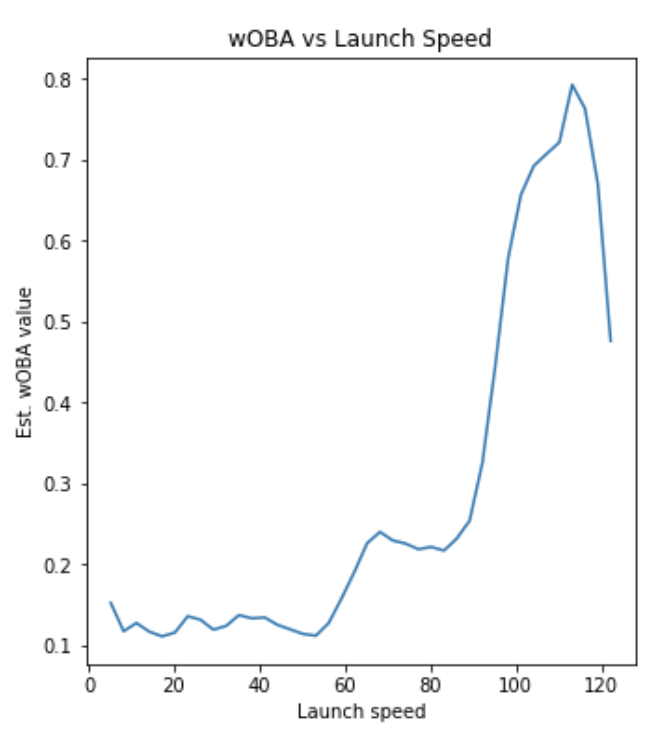
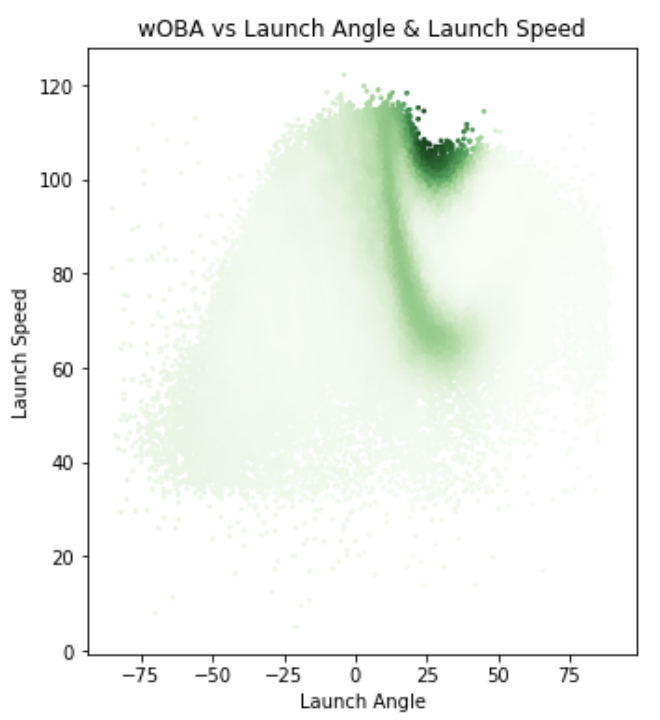

# CSCI4831-Final
### Final Project for CSCI 4831 Sabermetrics
### Michael Hering

Access statcast data file here: https://drive.google.com/file/d/1GhfxTh8w76iyEjUV-bq5qWqlKLqyS3IH/view?usp=sharing

#### List of Repo Contents:  
readme: README.md  
jupyter notebook application: Final.ipynb  
link to video: link.txt  

#### The Hit Effectiveness Statistic (HE):
For this project, I will analyze what types of hits produce the most offensive gain for a team by comparing certain features of hits to wOBA. More specifically, I will use the statcast data of the speed, angle, and position of hits to analyze if there is a relationship between these factors and how often a hit produces an advantage for the offense. This statistic, known as hit effectiveness (HE) will be able to identify what types of hits, evaluated by angle, speed, and position, are the most valuable for a batter to produce. As an extension of this, we will also look at what the overall HE is for a certain batter’s hits in order to value that player’s hitting quality. We will then take the batters with the top 10 HE scores and visualize their hit placement as well as speed and angle.  
  
The statcast database has statistics for the launch angle, launch speed, and landing position of every hit recorded over the 2017 season. This data, combined with batter info and wOBA scores, will be used in my analysis. In order to analyze this data, I wanted to first look independently at how launch angle and launch speed affect the wOBA value of some particular hit. We first have to clean up the data a little bit, by simply taking the mean of groups of data, so that our plot accurately reflects the relationship and has no misleading data points. We then can plot our data to obtain the graphs below:  
  

  
  
We can also display how launch angle and speed combine to affect the wOBA score by plotting the normalized wOBA values as a color gradient, where a darker green equates to a higher wOBA value.  
  
  
  
In order to present this statistic, I show the correlation for all hits concerning hit angle and outcome, hit speed and outcome, as well as hit location and outcome. I also show the correlation for all hits concerning hit angle and wOBA as well as hit speed and wOBA. Finally, I analyze the HE score for different batters hit’s to determine which batters produce the best hits.  

Images here

References: https://fivethirtyeight.com/features/the-new-science-of-hitting/