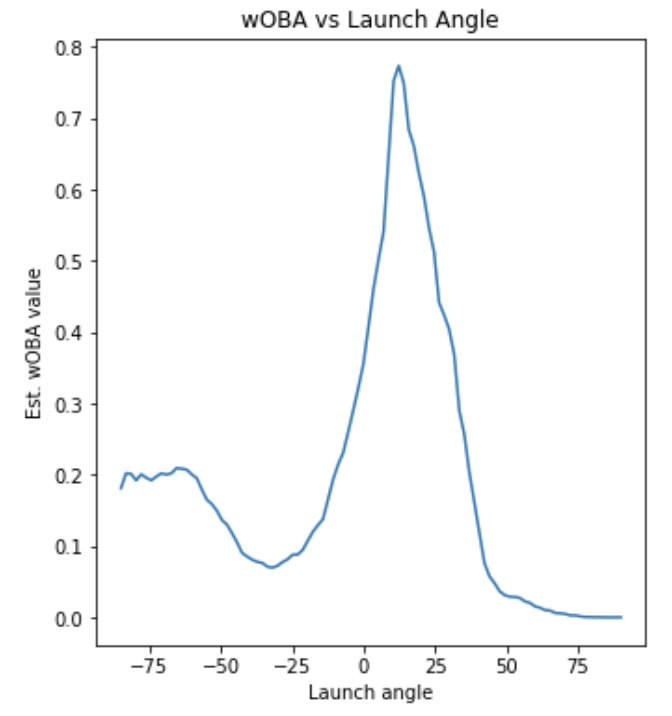
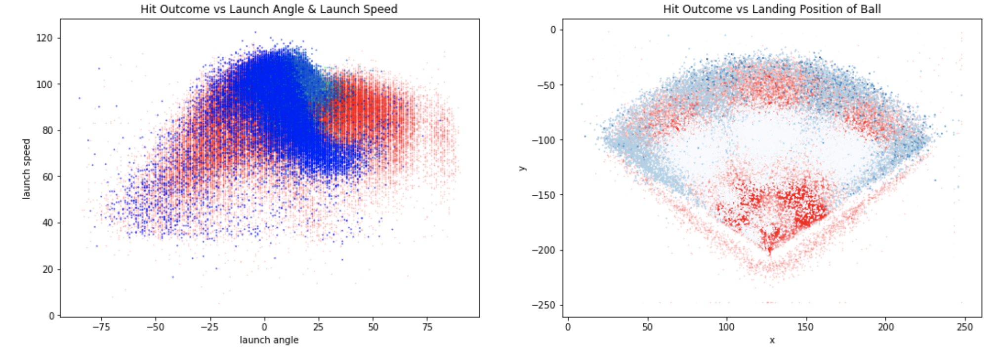
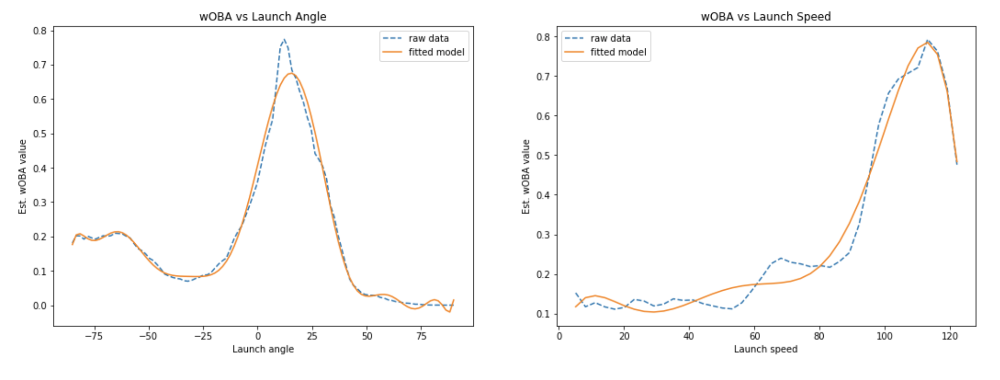
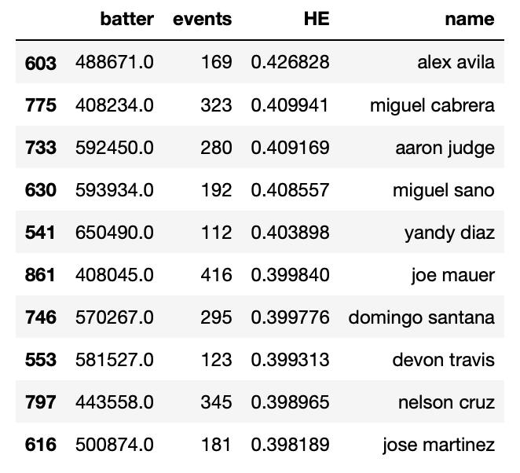
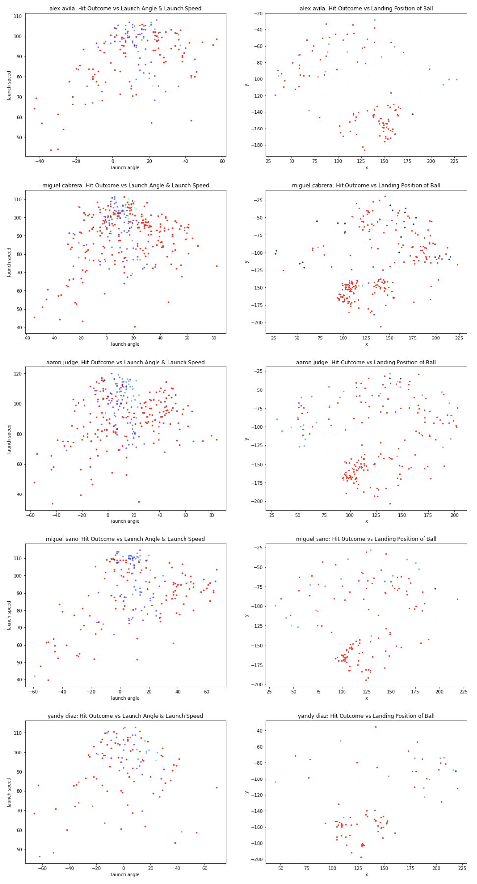
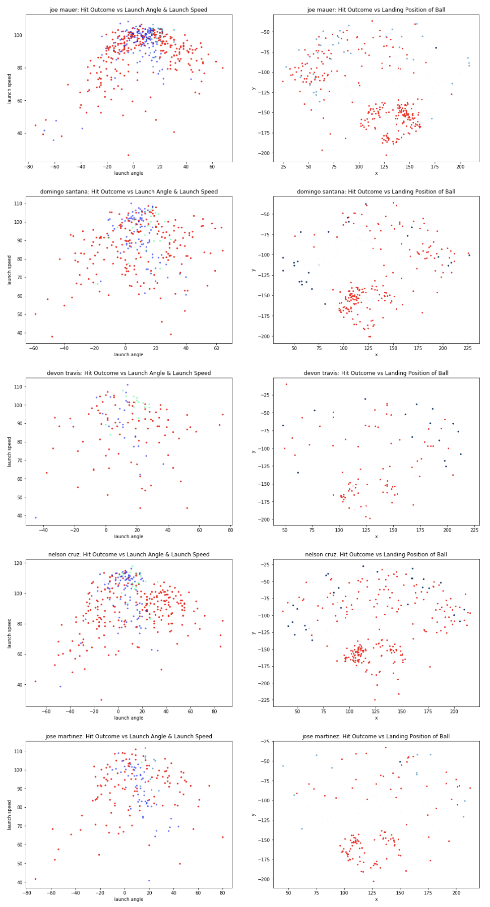

# CSCI4831-Final
### Final Project for CSCI 4831 Sabermetrics
### Michael Hering

Access statcast data file here: https://drive.google.com/file/d/1GhfxTh8w76iyEjUV-bq5qWqlKLqyS3IH/view?usp=sharing

#### List of Repo Contents:  
readme: README.md  
jupyter notebook application: Final.ipynb  
link to video: link.txt  

#### The Hit Effectiveness Statistic (HE):
For this project, I will analyze what types of hits produce the most offensive gain for a team by comparing certain features of hits to wOBA. More specifically, I will use the statcast data of the speed, angle, and position of hits to analyze if there is a relationship between these factors and how often a hit produces an advantage for the offense. This statistic, known as hit effectiveness (HE) will be able to identify what types of hits, evaluated by angle, speed, and position, are the most valuable for a batter to produce. As an extension of this, we will also look at what the overall HE is for a certain batter’s hits in order to value that player’s hitting quality. We will then take the batters with the top 10 HE scores and visualize their hit placement as well as speed and angle.  
  
The statcast database has statistics for the launch angle, launch speed, and landing position of every hit recorded over the 2017 season. This data, combined with batter info and wOBA scores, will be used in my analysis. In order to analyze this data, I wanted to first look independently at how launch angle and launch speed affect the wOBA value of some particular hit. We first have to clean up the data a little bit, by simply taking the mean of groups of data, so that our plot accurately reflects the relationship and has no misleading data points. We then can plot our data to obtain the graphs below:  

  
We can also display how launch angle and speed combine to affect the wOBA score by plotting the normalized wOBA values as a color gradient, where a darker green equates to a higher wOBA value.  
  
  
  
From the graphs above, we can notice that there are certain "sweet spots" of both angle and speed of a hit that will produce the highest wOBA for that hit.
  
## Launch angle & speed, landing position VS hit outcome  
  
We can also look at how the outcome of a hit relates to both the launch angle and launch speed of the hit, as well as the landing position of the ball.  
  
  
  
We notice first that the distribution of hit outcome vs launch angle & speed is similar to that of the distribution of wOBA value vs launch angle & speed. We again see that sweet spot of an angle between 0-25 degrees and a speed between 60-115 MPH. Looking at the graph of hit outcome vs landing position gives us a good idea of where the best hits are placed, and while not directly related to the HE statistic this graph is still an important visualization.  

## Fit a model based on launch angle, launch speed

  

## Top 10 HE scores for batters in 2017   
Using these models, let's predict and visualize the HE of hits for the top 10 batters hits using HE = (Af(angle) + Sf(speed)) / 2 

  

  

  

References: https://fivethirtyeight.com/features/the-new-science-of-hitting/